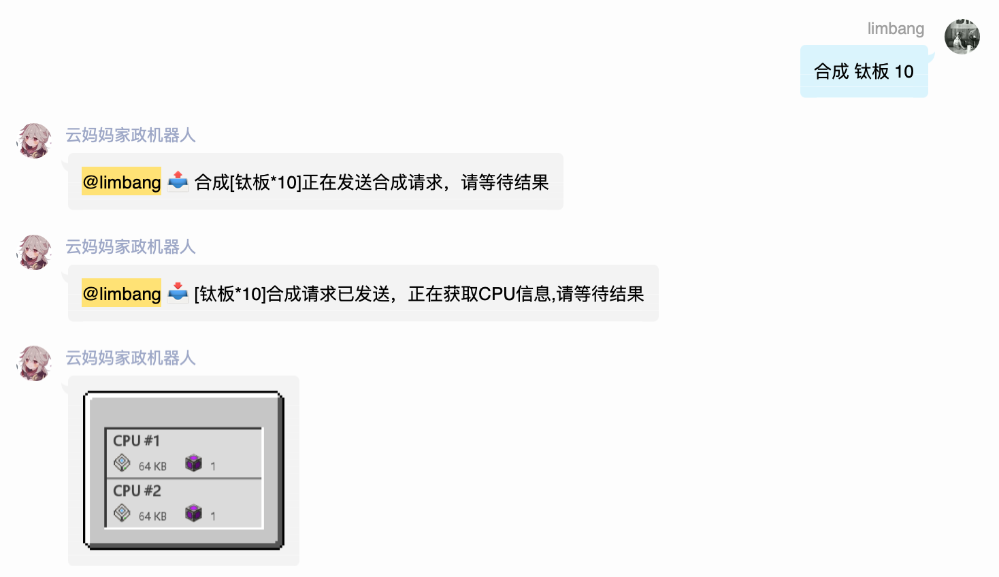
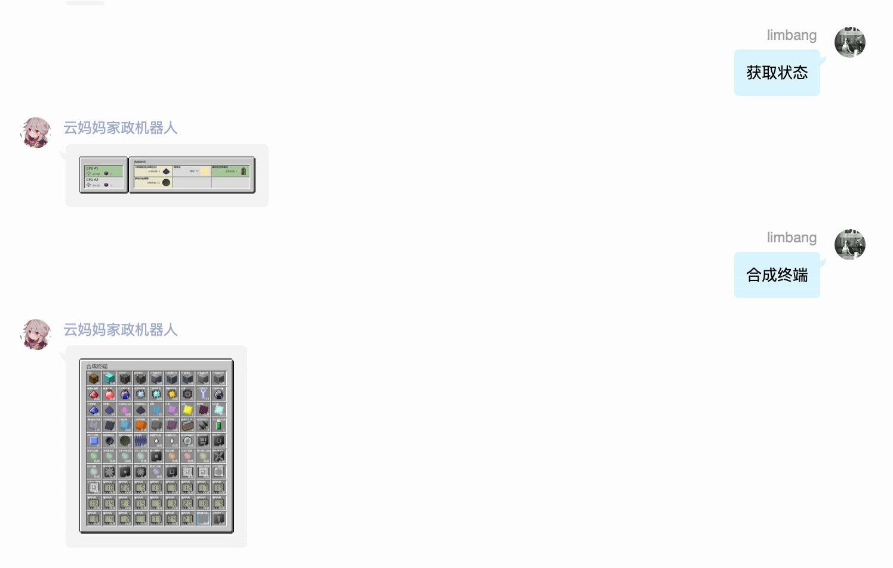
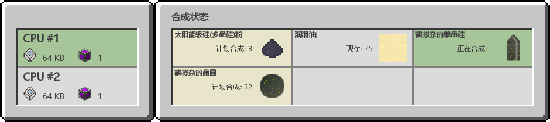
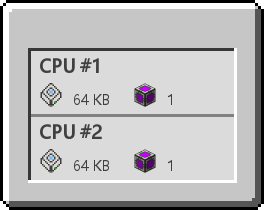
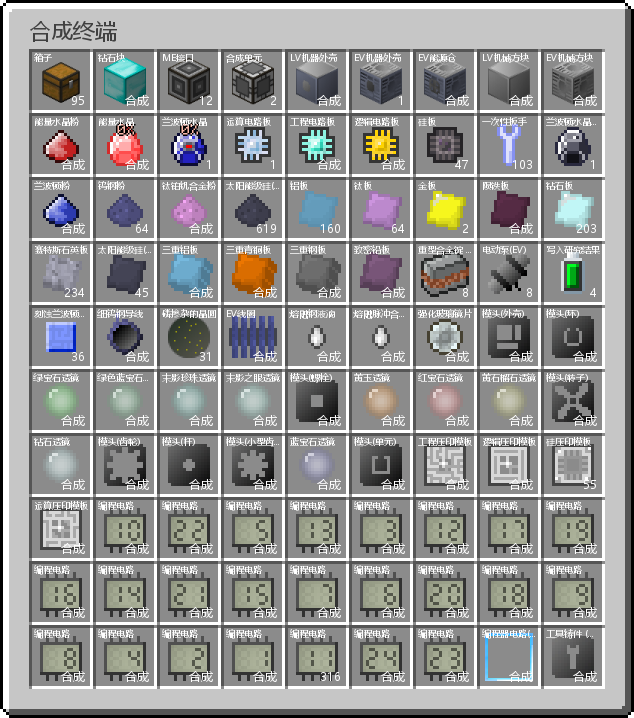
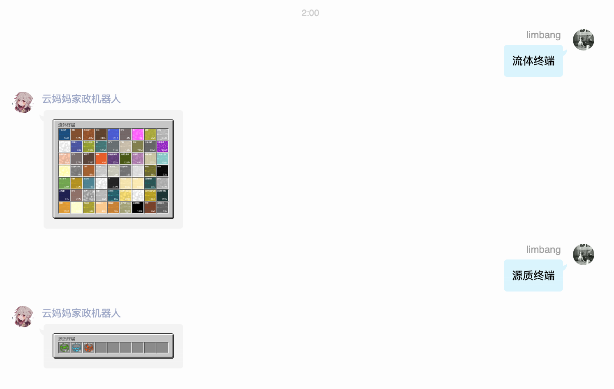
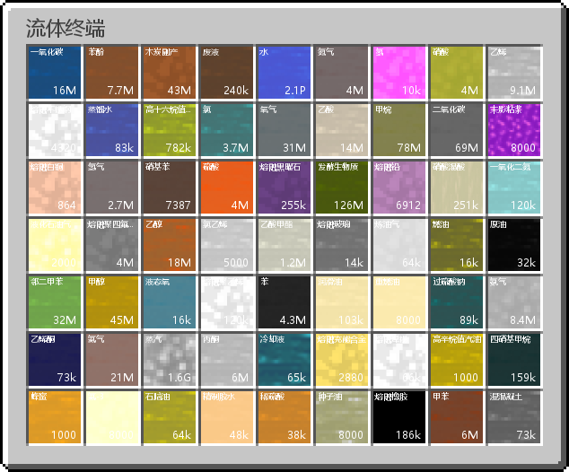
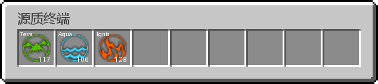

<div align="center">

[](https://github.com/limbang/mirai-console-mcsm-plugin/releases)

[](https://github.com/limbang/mirai-console-mcsm-plugin/blob/master/LICENSE)
[](https://github.com/mamoe/mirai)

本项目是基于 Mirai Console 编写的插件
<p>用于控制 <a href = "https://github.com/z5882852/RemoteOC-GTNH-AE2">RemoteOC-GTNH-AE2</a> 后端 api 实现在群里下单</p>

</div>

## 使用方法
### 1. 部署 RemoteOC-GTNH-AE2 客户端和服务器

参考 [RemoteOC-GTNH-AE2](https://github.com/z5882852/RemoteOC-GTNH-AE2) 安装部署

### 2. 需要把资源文件放到 data/top.limbang.RemoteOC 目录下

资源文件可以使用 [nesql-exporter](https://github.com/z5882852/nesql-exporter) 从游戏导出也可以下载我提供的,使用 [NesqlUtils](src/main/kotlin/utils/NesqlUtil.kt) 导出 json 文件,测试方法见 [testExport](src/test/kotlin/utils/NesqlUtilTest.kt)

[IRAR](https://www.mcmod.cn/class/3115.html) 数据转换使用 [IRARUtils](src/main/kotlin/utils/IRARUtil.kt) 转换,测试方法见 [testIRARExport](src/test/kotlin/utils/IRARUtilTest.kt)

```
目录结构
-- data/top.limbang.RemoteOC/
    -- image/
        -- fluid/
        -- item/
    -- fluids.json
    -- items.json
```

### 3. 添加需要管理的 RemoteOC-GTNH-AE2 后端 api 地址和 token
```
/oc add url token
```

## 命令介绍

### 后台命令
- `/oc add url token` 添加需要管理的 RemoteOC-GTNH-AE2 后端 api 地址和 token

### 群命令团队命令 

团队的作用是让多个成员操作同一客户端

- `创建团队 团队名称` 创建一个团队
- `解散团队` 解散当前所在的团队(需要队长权限)
- `邀请加入 @成员` 邀请指定成员加入当前团队(需要队长权限)
- `加入团队` 加入被邀请的团队(需要在邀请列表中)
- `退出团队` 退出当前所在的团队(需要在团队中, 队长除外)
- `踢出团队 @成员` 踢出指定成员(需要队长权限)
- `团队列表` 显示所有团队列表
- `团队信息` 显示当前所在的团队信息
- `团队帮助` 显示团队命令帮助

### 群命令客户端命令

用来操作 AE

- `绑定客户端` 绑定客户端到当前所在的团队，绑定后即可使用远程控制功能
- `解绑客户端` 解绑当前绑定的客户端
- `获取状态` 获取当前团队的 AE CPU 状态
- `合成终端` 获取当前团队的 AE 的可合成物品
- `合成 物品名称 [数量]` 合成指定名称的物品，数量为可选参数，默认为 1
- `物品终端 [过滤名称]` 获取当前团队的 AE 的所有物品，可选参数为过滤名称
- `流体终端` 获取当前团队的 AE 的所有流体列表
- `源质终端` 获取当前团队的 AE 的所有源质列表
- `取消合成 CPU名称` 取消指定名称的CPU的合成任务(使用[石英切割刀]为CPU命名)
- `客户端帮助` 显示客户端操作帮助

## 待实现的功能

- [ ] 获取物品 （带过滤）
- [ ] 空闲通知
- [ ] 电量获取

## 演示截图

### 合成物品


### 获取状态






### 合成终端


### 流体终端




### 源质终端



